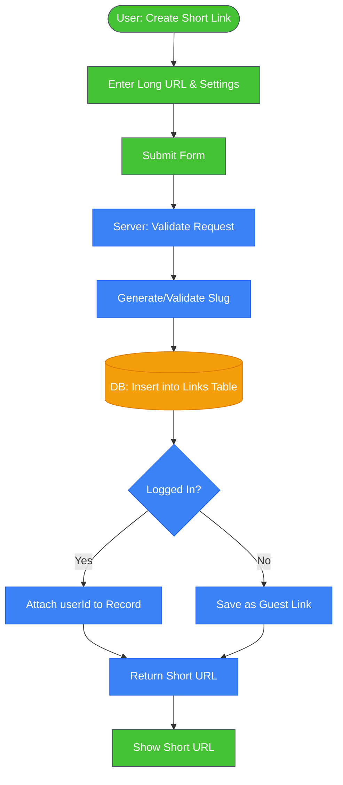
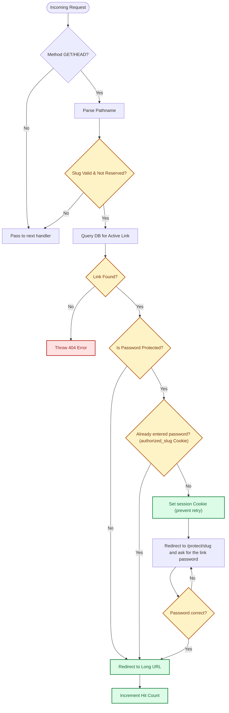

# Architecture

# Server
## API Overview

| Method | Endpoint                      | Description                                                          |
| ------ | ----------------------------- | -------------------------------------------------------------------- |
| GET    | /api/links                    | Retrieve all active links for the authenticated user.                |
| POST   | /api/links                    | Create a shorten link with optional expiration date and/or password. |
| POST   | /api/links/verify             | Verify a password for a protected link and authorize access.         |
| DELETE | /api/links/:id                | Soft-delete a single link.                                           |
| DELETE | /api/links/bulk-delete        | Soft-delete multiple links                                           |
| GET    | /api/dashboard/overview       | Retrieve summary data for the authenticated user.                    |
| GET    | /api/dashboard/creation-trend | Retrieve authenticated user's creation count for last 30 days.       |
| GET    | /api/users                    | List all active users.                                               |
| POST   | /api/users                    | Create a new user.                                                   |
| patch  | /api/users/:id                | Update user account.                                                 |
| DELETE | /api/users/:id                | Soft-delete user account.                                            |
| GET    | /api/user/profile             | Get/Refresh the user session.                                        |

## Link Creation Flow

## Link Redirection Flow

See `/server/middleware/01.redirect.ts`.

